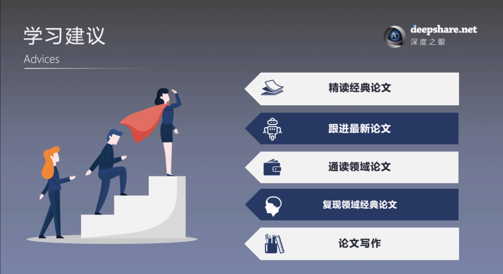
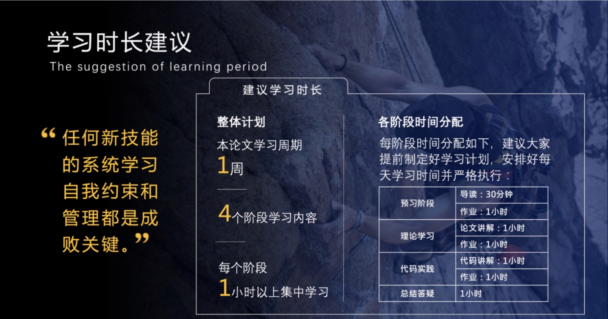
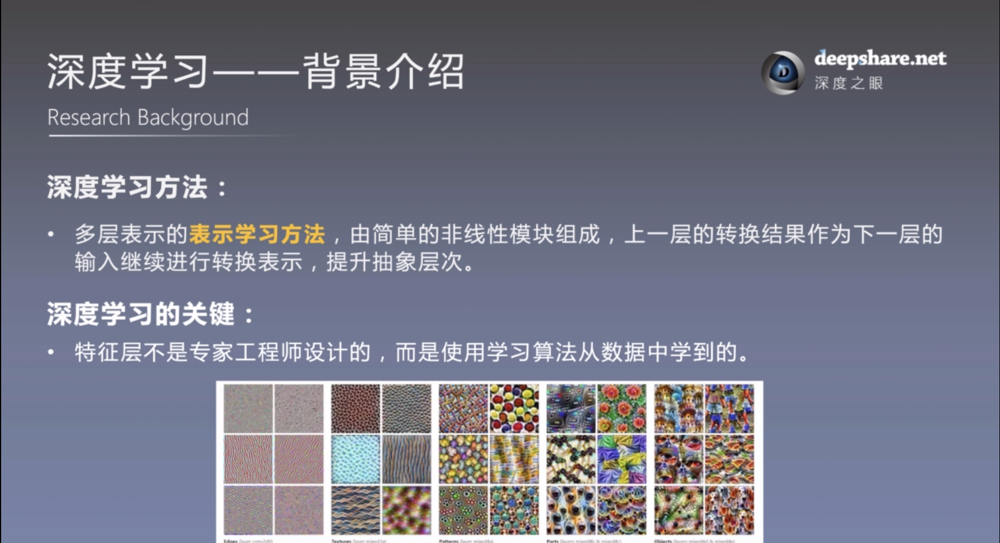
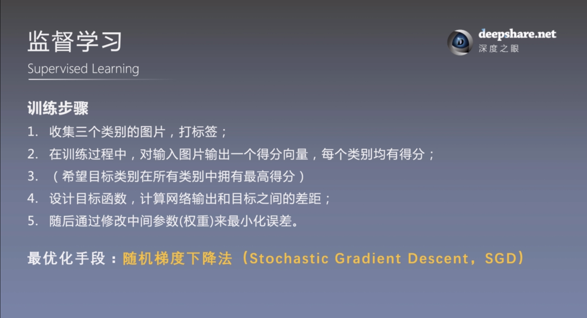
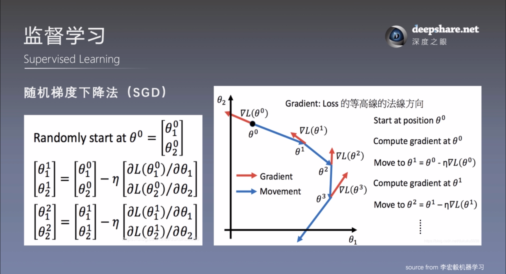
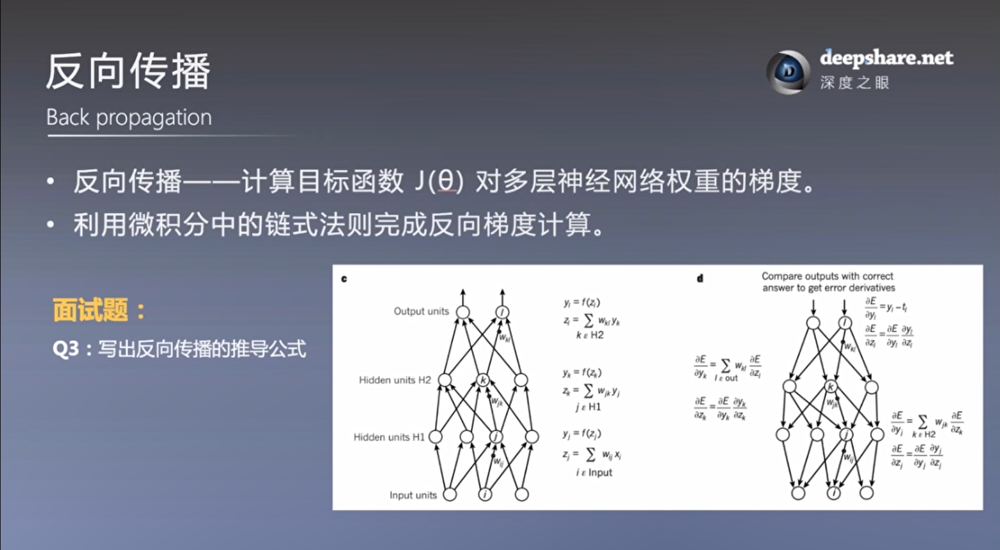
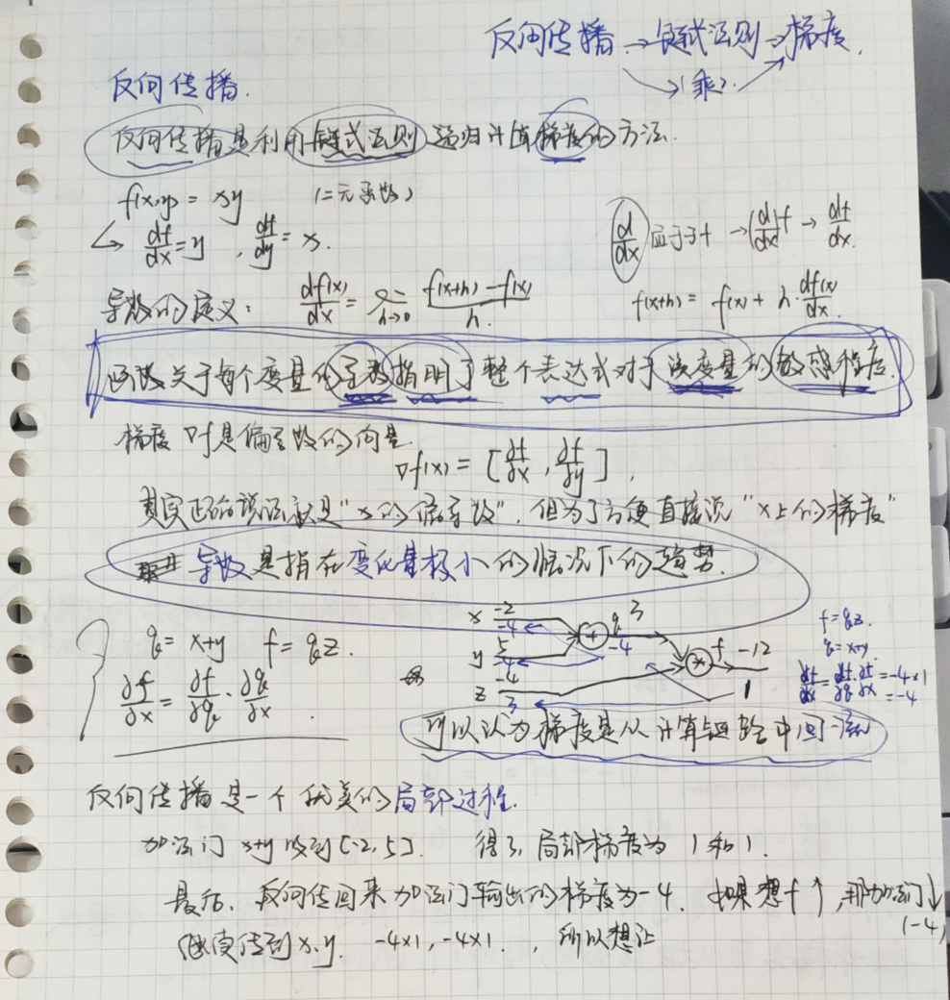

# DeepLearning

## pre预备

* 
* 
* 

## 深度学习背景介绍

* 传统机器学习需要专业领域专家进行特征抽取的设计，深度学习则不同，深度学习通过从数据中学习到的特征层进行特征抽取。
* 
* 

## 深度学习基本结构

* 

## 深度学习应用领域

* 

## 监督学习

* 训练步骤：

* 随机梯度下降_SGD

* 总结

### 反向传播（一种用于计算梯度的算法）

* 

* Q3_反向传播公式推导；
* [CS231n课程笔记翻译：反向传播笔记](https://zhuanlan.zhihu.com/p/21407711)
* [神经网络反向传播的数学原理](https://zhuanlan.zhihu.com/p/22473137)
* [神经网络BP反向传播算法原理和详细推导流程](https://blog.csdn.net/qq_32865355/article/details/80260212)

1. 
2. 
3. 
