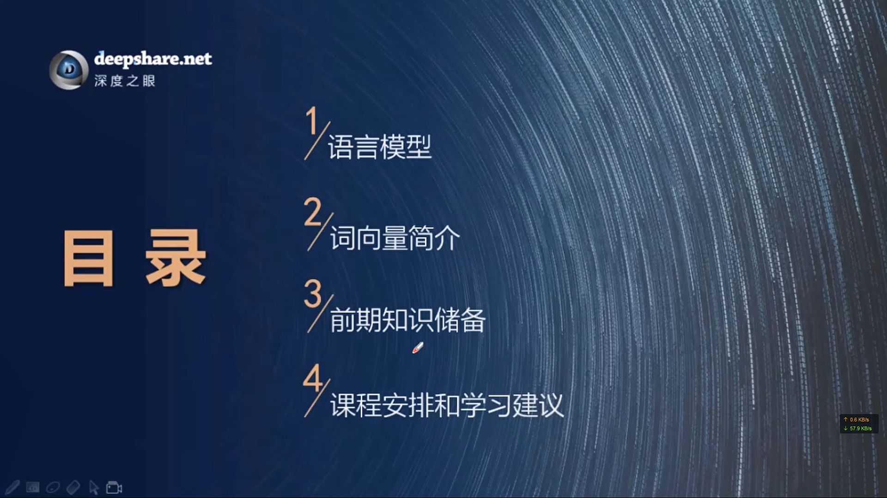
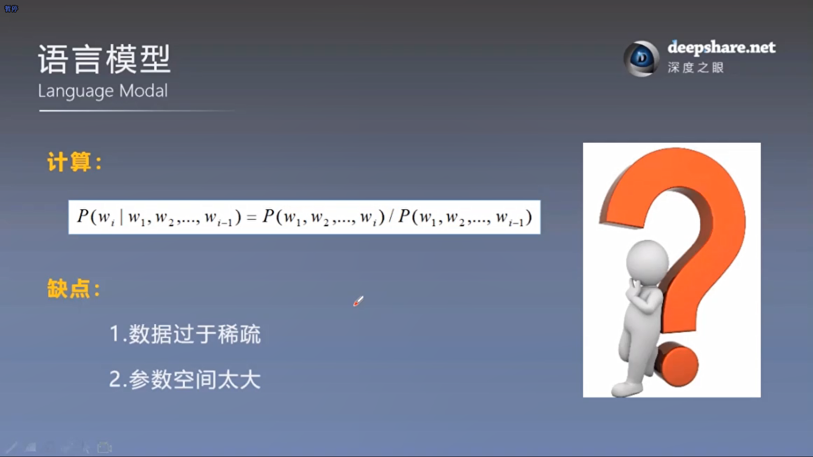
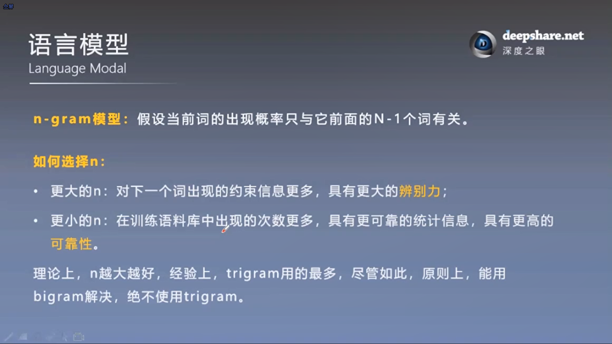
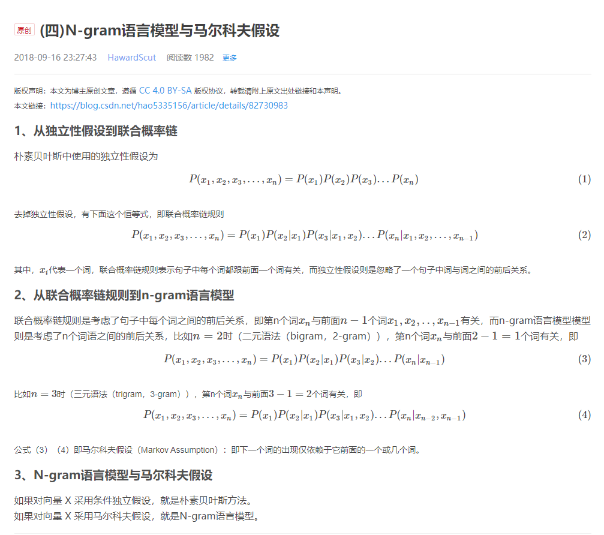
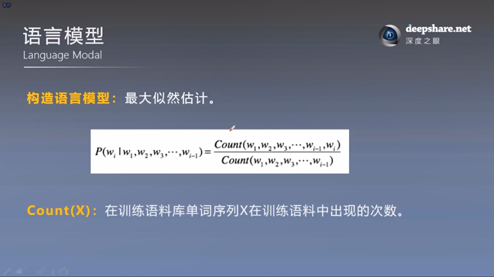

# Word2Vector

## 入门NLP课程

### 语言模型

有些词组合在一起的概率是很小很小的，所以会比较稀疏，有很多是很小没有太大意义的,并且造成参数空间太大。

#### 马尔科夫假设

本状态至于前边的状态有关

基于马尔科夫假设，提出：

下一个词的出现仅依赖于它前面的一个词或几个词

于是提出n-gram模型：

n取1、2、3，称为unigram bigram trigram（一元二元三元语法）
n同样可以取的更大

[(四)N-gram语言模型与马尔科夫假设](https://blog.csdn.net/hao5335156/article/details/82730983)

### 词向量

#### One-Hot

实际工程中很少使用One-Hot向量，无法处理新出现的词典里现在没有的词汇

#### 分布式表示 Distributed Word Representation

Embedding || CBOW，Skip-gram（word2vec）
[参考链接：word2vec和word embedding有什么区别](https://www.zhihu.com/question/53354714)

训练词向量

