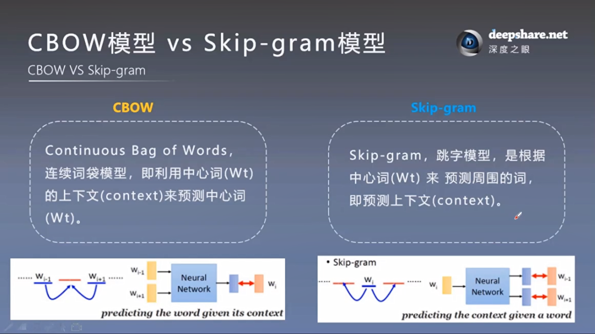
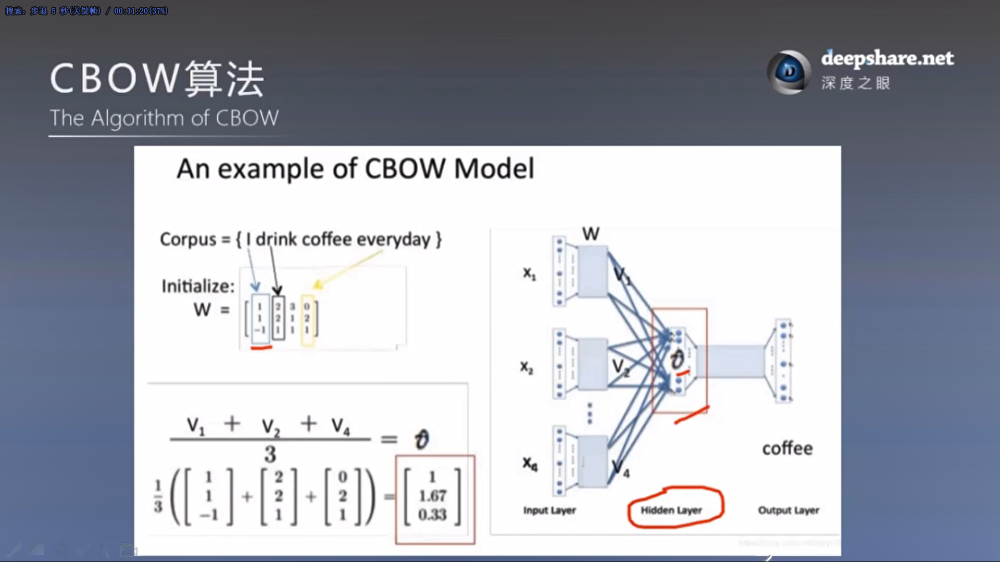

# Word2Vector 核心 - CBOW & Skip-gram

> 由于NNLM计算复杂度太大。Word2Vector 就是一种 简化版的神经网络语言模型。 通过语言模型来获取词向量。

## CBOW模型（Continuous Bag of Words)连续词袋模型

> 已知上下文，来预测中心词的概率，求最大似然

* 投影层采用求和平均来取代拼接
* 双向上下文--上下文词序就没有影响了

第二层的W'是n*V维的，输出就是V维的，代表需要预测的词对应词库中每一个词的概率。

这个例子里只有4个词。

下一层采用softmax激活，选择最大的概率，这里是第三个coffee最大。

接下来需要反向传播，损失函数的依据就是这次的预测输出和本来正确的监督标签coffee对应的One-Hot表示。这里就是 [0.23, 0.03, 0.62, 0.12] 和 [0, 0, 1, 0] 对比计算损失。

## Skip-gram模型（Skip-gram）跳字模型

## 实验和结果

## 讨论和总结
