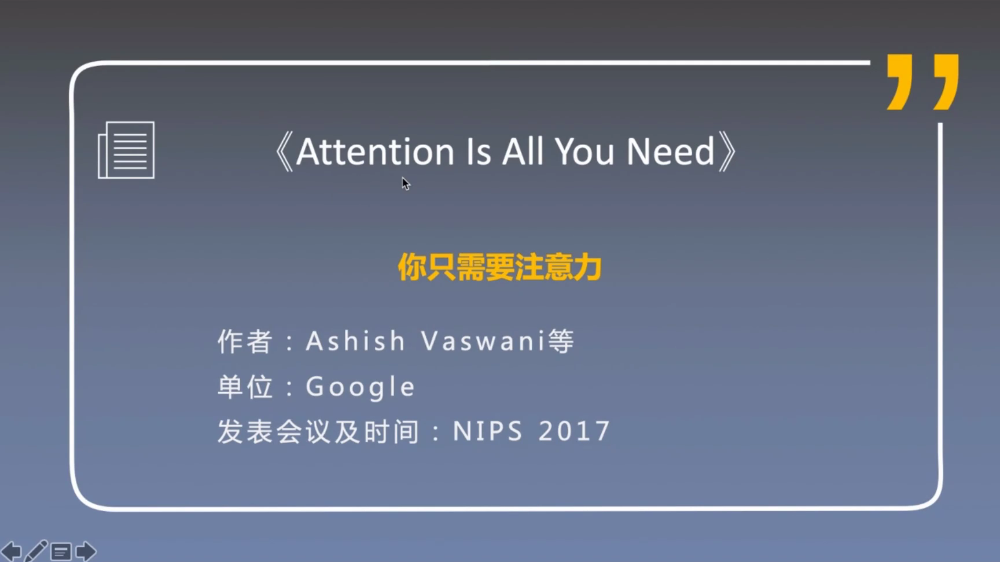
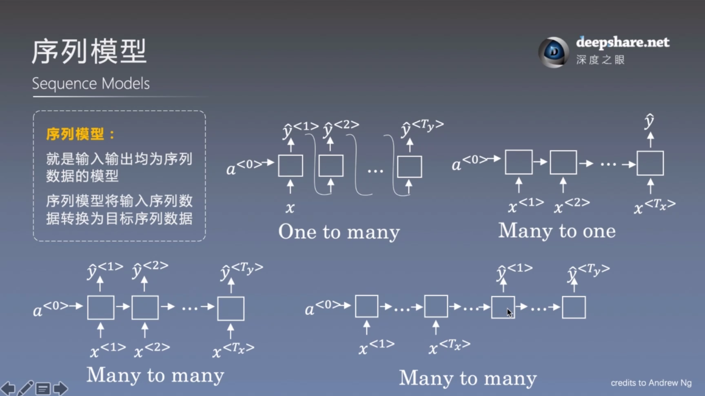
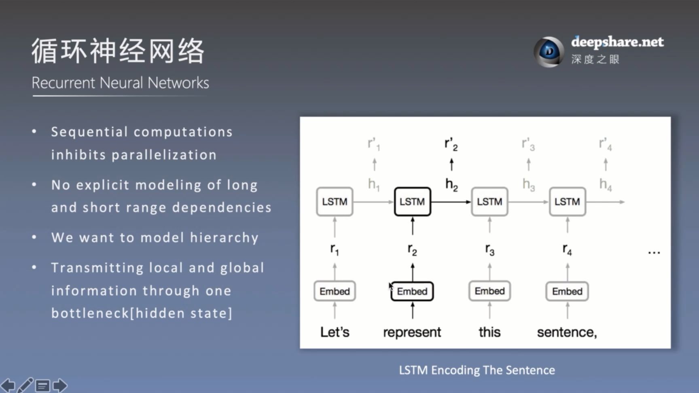
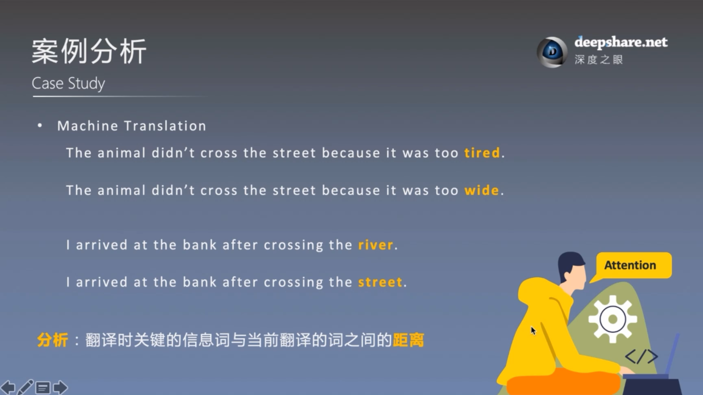
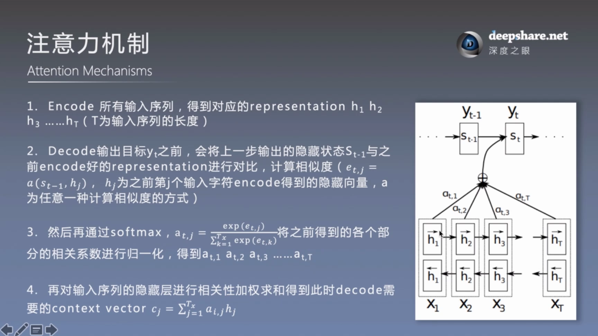
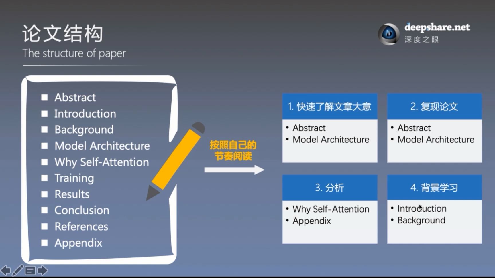
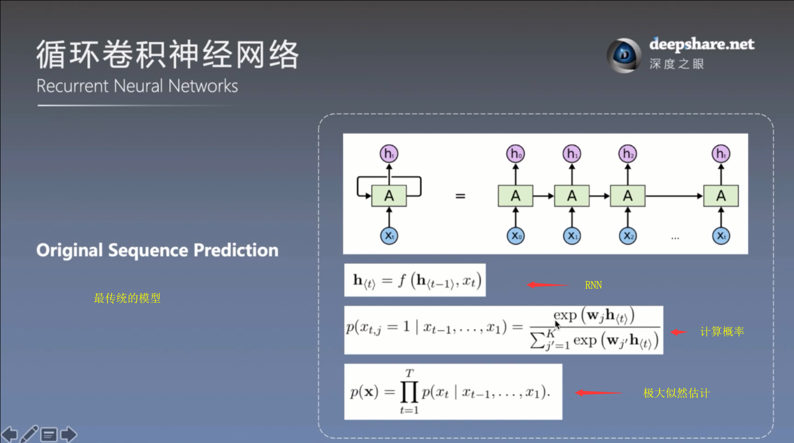
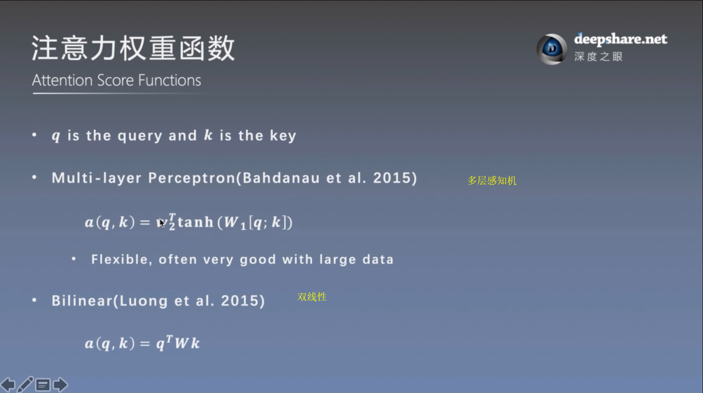
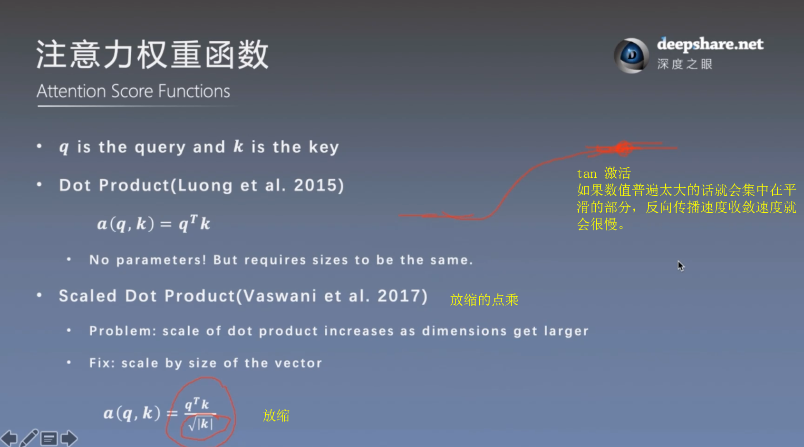

# Transformer

RNN 并行性不高 把所有信息压缩到一个向量，局部全局信息都不好

CNN 并行性较好、容易处理范围内邻近的数据，但是如果想要处理长距离的以来的话就需要多层来实现了，因为每层的窗口大小有限，只能通过更上层来实现。

## **关于读论文** (**重要**)

1. **Abstract** ： 这篇论文解决的什么样问题、主体的模型用的什么方法、取得的什么样的效果
    * 阅读文章前必须要精读的部分，一定要弄清楚这篇文章 在做什么 用什么方法 效果怎么样
2. **Introduction** : 引言部分会介绍与本文相关的方法，进而引出之前方法的缺陷
3. **Background** : 介绍其他解决缺陷的方法，**但**同时也存在着缺陷
    * Introduction和Background部分 是对摘要的进一步的扩充，继续写之前的state-of-art的经典模型是怎么去解决问题的，算法发展的脉络是怎么样的，以及他们对应的优缺点。
    * 这两部分在最初读论文时是不需要去着重关注的。
4. **Model Architecture** ： 介绍模型完完全全的架构
    * 一定要精读的部分，拿笔手推一下公式，这样才能有所收获、有所深刻理解。
    * 本文(Transformer)还单独拎出了两个部分
    * 1 Why Self-Attention ： 进一步从几个角度来进行模型和其他模型的比较
    * 2 Training : 介绍训练技巧，这部分适合复现的时候再精读
5. **Experiment Setting** : 用了什么数据集，模型训练,做了哪几种配置的实验
6. **Results** ：实现效果，不同角度、不同的配置设置，说明不同角度的能力，与之前的比较提升
7. **Conclusion** ： 总结优点，展望
8. **References** ： 参考文献
9. **Appendix** ： 附录

> **读论文最好的方式**
>
> **不要断断续续，要连续的时间内按照自己的节奏来读论文**

* **从整体到细节**

1. **了解大意**
    1. Abstract
    2. Model Architecture
2. **复现论文**
    1. Abstract
    2. Model Architecture
3. **分析**
    1. Why Self-Attention
    2. Appendix
4. **背景学习**
    1. Introduction
    2. Background

## Transformer 论文精读

注意力权重函数

