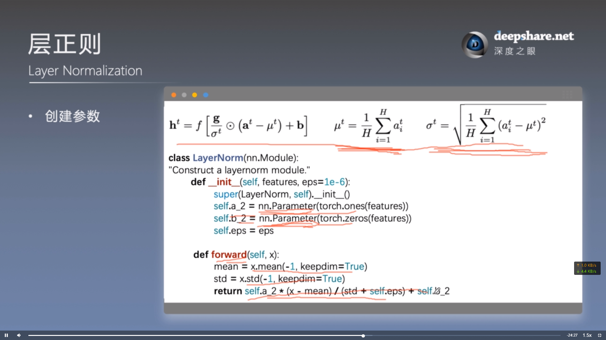

# pytorch twn

1. log_softmax比softmax多计算一次log，意义在于 加快计算速度，数值上也更稳定。 参考资料：[PyTorch学习笔记——softmax和log_softmax的区别、CrossEntropyLoss() 与 NLLLoss() 的区别、log似然代价函数](https://blog.csdn.net/hao5335156/article/details/80607732)

2. [Pytorch中torch.nn.Softmax的dim参数含义](https://blog.csdn.net/sunyueqinghit/article/details/101113251) 就是在第几维上 sum=1

3. tf.nn.softmax中dim默认为-1,即,tf.nn.softmax会以最后一个维度作为一维向量计算softmax 注意：tf.nn.softmax函数默认（dim=-1）是对张量最后一维的shape=(p,)向量进行softmax计算，得到一个概率向量。不同的是,tf.nn.sigmoid函数对一个张量的每一个标量元素求得一个概率。也就是说tf.nn.softmax默认针对1阶张量进行运算,可以通过指定dim来针对1阶以上的张量进行运算,但不能对0阶张量进行运算。而tf.nn.sigmoid是针对0阶张量,。  参考资料：[tensorflow中交叉熵系列函数](https://zhuanlan.zhihu.com/p/27842203)

4. ？？？？ python 深拷贝、浅拷贝

5. mean std(标准差) 
